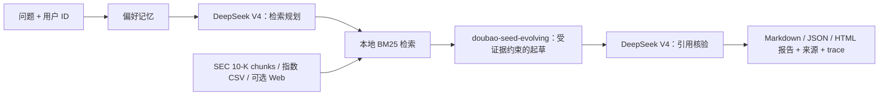

# 系统设计说明

## 目标与边界

本系统是金融研究 Personal Agent，不是自动交易系统，也不输出投资建议。它的承诺刻意收窄：对于已支持的 filing 或市场数据问题，返回可让 reviewer 回溯的证据。这一取舍优先保证可追溯性，而不是堆叠大量无法验证的工具。

当前语料为十家指定公司的 SEC 10-K，以及自 2005 年起的沪深 300、上证综指、深证成指每日收盘价与成交量。可选 Web 搜索用于发现公开信息，但其结果摘要绝不会被静默混入一级 filing 证据。每一条来源都会明确标记为 `sec_10k`、`market_data` 或 `web_search`。

## 数据接入与溯源

SEC 下载器先查询每家公司的 `data.sec.gov/submissions` feed，从中选择 `10-K` 记录，再从 SEC Archives 下载主文档。它强制要求符合 SEC 规范、且含联系邮箱的 User-Agent。追加式 `manifest.jsonl` 会记录 CIK、ticker、form、filing/report date、accession number、archive URL、本地路径和抓取时间；原始 HTML 随之保存在本地。任一公司下载失败时，`download_report.json` 会暴露失败，而不会将不完整语料伪装成完整结果。

沪深 300、上证综指和深证成指数据来自腾讯财经公开 K 线端点。由于单次响应有行数上限，下载器按自然年分段请求；输出规范化的 `date,close,volume` CSV，并写入 metadata sidecar，其中包含来源端点、全部请求 URL、下载时间、行数与覆盖区间。区间涨跌由程序计算，始终引用数据文件和来源端点，不依赖模型计算。

索引器会移除 script/style、隐藏的 inline-XBRL header/resources 及高密度 schema/context 模板噪声，再把正文切为重叠 chunk。每个 chunk 保留文档与 chunk ID、标题、来源 URL、filing date、来源类型和 accession locator。这些字段会穿过检索流程，并在最终来源列表中显示 accession 与 chunk ID，支持回答三个排障问题：来自哪份文档、公开网站上的位置在哪里、实际命中了哪个检索片段。

## 检索、推理与记忆

检索使用确定性的 BM25 词法评分。英文按词切分，中文按重叠字符 bigram 切分，因此 `上海证券交易所` 这类查询会产生多个可匹配 term，而不是整句全有或全无。没有选向量数据库是刻意取舍：当前语料规模小，评分输入可检查，无托管服务依赖，并能离线演示。用户可通过 `--company` 先缩小语料范围。

用户偏好独立保存在以 user ID 为键的 JSON 中。只有明确表达偏好时才写入，例如 “I care”、“I'm interested in”、“focus” 或“关注”；普通提问不会变成永久记忆。当前只识别可审计的小型白名单：liquidity risk、debt maturity、cash flow、profitability、competition 和 valuation。这样做会漏掉一些细腻的偏好，但避免每轮问题都污染长期记忆。

两个指定模型承担不同职责。DeepSeek V4 生成受限检索计划，并独立核验最终草稿的引用标签；`doubao-seed-evolving` 仅根据提供的证据起草分析。规划器并非形式化步骤：其输出最多取 24 个 lexical retrieval token，追加到原问题和显式偏好后才进入 BM25。对于“我应该重点关注什么？”这类模糊问题，它可以补充 `liquidity`、`debt`、`maturity` 等检索词；但它不能引入证据或形成最终主张。提示词禁止外部事实，并要求使用 `[S#]` 标签。

每次远程请求设有 600-token 输出预算，使三个串行阶段在交互式 CLI 中保持可用；这一预算不截断传给模型的检索证据。最终程序守卫会拒绝没有合法来源标签的远程文本，并回退到离线提取式回答。trace 只显示每阶段是否实际使用远程模型，不泄露密钥。

验证器是可测试的控制点，而不是抽象口号。集成测试向其提供一条带引用的流动性证据、规划词、无引用的 Doubao 草稿和 DeepSeek 的核验结果；最终答案采用带 `[S1]` 的核验改写，而不是无依据草稿。这并不声称两个模型存在未经测量的质量差异，而是证明控制边界有效。移除 Doubao 会失去独立的专业化起草阶段；移除验证器则会让貌似带引用但其实不受支持的草稿到达用户。生产环境中的模型对比应使用标注评测集，本项目不虚构该结论。

我考虑过带任意工具和自主重试的通用 ReAct loop，以及向量数据库加 embedding。它们能扩展功能面，却增加隐藏的模型决策、embedding 溯源、服务依赖和难以复现的排序。这个受约束的 loop 更适合现场演示，也更容易在面试中说明取舍。

## 已知限制与失败模式

- 即使有中文 bigram，BM25 仍可能漏掉词面重叠很少但语义相关的段落。例如 `top-line pressure` 未必能召回只写了 `revenue decline` 的文字；demo 公开展示这一词法失败，而非隐藏它。它也不理解复杂财务表格的列关系。
- HTML 展平可能把表格单元格拼接，或破坏罕见的旧字符编码。引用链接仍允许用户打开原始 filing 核验。
- SEC filing 可能修订、发行人名称可能变化，recent-submission feed 也不一定暴露任意长的历史；manifest 会明确记录本次选中的 accession 与日期。
- Web 结果是可变且质量不一的摘要，不能替代打开目标页面；它们始终是 opt-in 且独立标注的来源。
- 偏好提取故意保持保守，可能遗漏细腻表达，也不推断用户画像。
- 本地 JSON 记忆没有加密、认证、并发控制、保留策略或用户删除入口，只适用于单用户 demo。
- 远程 API 可能失败、限流，或要求不同的模型部署名称。系统会透明地回退，而不是掩盖失败。
- HTML 报告是仅用标准库实现的静态展示层：所有动态内容都会转义，只有绝对 HTTP(S) 来源 URL 能成为链接，并嵌入限制性 CSP meta 策略。它不是交互式 Web 应用，也不渲染任意 Markdown 或用户 HTML。
- 本系统不提供投资建议、不执行交易、不获取实时 A 股个股数据，也不保证能从 SEC 复杂表格中准确抽取数值。

## 更多时间时的优先改进

1. 增加 XBRL-aware 报表抽取与表格溯源。这会首先改善同比收入、利润率、债务到期和现金流回答，因为每个数字都能链接到 fact、单位、期间和 filing context。
2. 增加混合检索：金融领域 embedding + BM25、reranker、评测集和逐查询检索诊断。它能缓解词汇失配，同时保留词法可解释性。
3. 扩展市场接入至更多主要 A 股指数和个股，同时加入数据源健康检查、交易日历校验、复权语义与新鲜度告警。
4. 将记忆升级为真正用户拥有的存储：认证、加密、编辑/删除、过期与显式同意。当前 JSON 的可见性是为了 demo 可解释性，而不是生产安全性。
5. 在增加工具或文档之前，先增加自动化来源回归测试、模型输出的引用 precision/recall 检查和评测面板。
