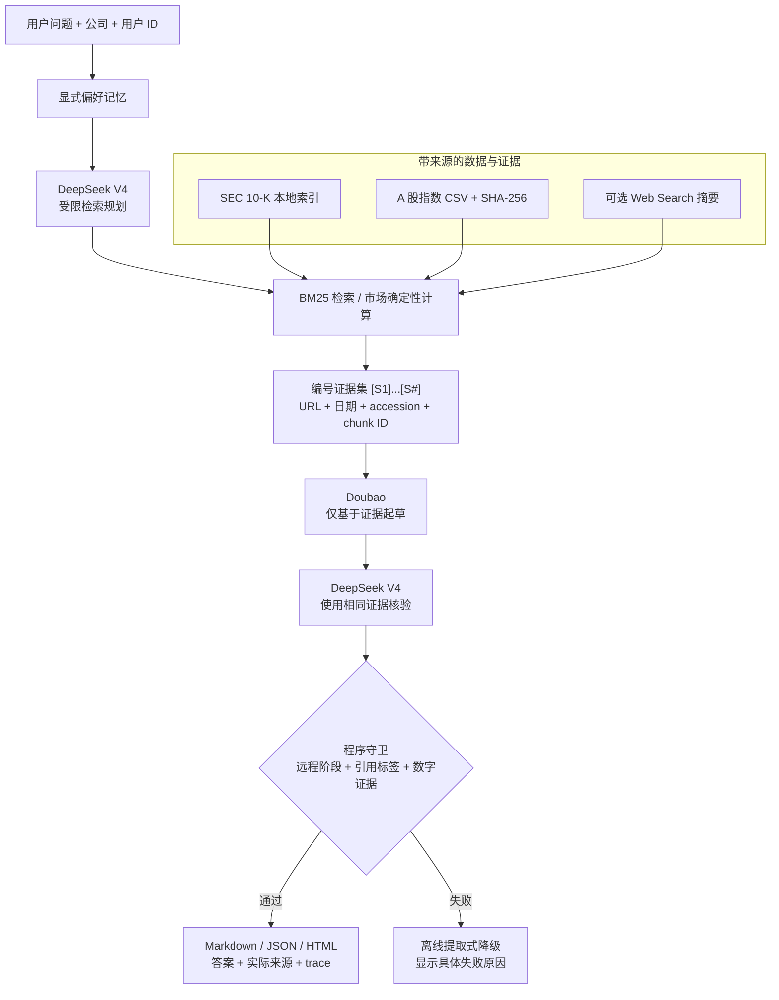

# Evidence-First Financial Agent

[](https://github.com/sky910140/financial-agent-takehome/actions/workflows/ci.yml)

中文 | [English](README_EN.md)

一个可本地运行、可追溯、可验证的个人金融研究 Agent。系统先从 SEC 10-K、A 股指数和公开网页中获取带来源的证据，再由 `doubao-seed-evolving` 起草、DeepSeek V4 规划和核验；引用或数字校验失败时，明确降级为离线提取式回答。

本项目不提供投资建议，不执行交易，也不会把模型训练知识伪装成当前数据来源。

## 可验证结果

| 项目 | 当前结果 |
| --- | --- |
| SEC 数据 | 10 家公司最新 10-K，3,978 个可检索片段 |
| A 股市场数据 | 沪深 300、上证综指、深证成指，20 年以上日收盘价和成交量 |
| 检索评测 | 5 个黄金问题，Hit@5 = 5/5 |
| 自动化测试 | 44/44 通过，覆盖率 88% |
| 多模型链路 | DeepSeek 规划 → Doubao 起草 → DeepSeek 核验 |
| 输出格式 | Markdown、JSON、安全的独立 HTML 报告 |
| 失败处理 | 模型、网络、引用或数字守卫失败时明确降级，不伪装成功 |

## 系统架构



关键设计不是“多调用一个模型”，而是职责分离和确定性信任边界：模型只能生成候选答案，程序决定候选答案能否交付。完整取舍见 [DESIGN.md](DESIGN.md)。

## 五分钟运行

要求 Python 3.11+。运行时没有强制第三方依赖，仓库已提交市场数据和 SEC 检索索引，因此首次克隆后无需下载外部数据即可演示。

```powershell
git clone https://github.com/sky910140/financial-agent-takehome.git
cd financial-agent-takehome
python -m venv .venv
.\.venv\Scripts\Activate.ps1
python -m pip install -e .
```

先验证完全离线、确定性的两条路径：

```powershell
# 20 年沪深 300 区间快照
python -m finagent market --file data/market/csi300.csv --start 2006-07-10 --end 2026-07-10

# 检索黄金问题回归
python -m finagent eval-retrieval
```

即使没有模型密钥，也可以运行带引用的离线 SEC 问答：

```powershell
python -m finagent ask "Summarize liquidity and debt-related risks." --company Apple --trace
```

输出会明确标记 `Offline extractive mode`，并保留 SEC URL、filing date、accession 和 chunk ID。

## 配置两个指定模型

复制配置模板：

```powershell
Copy-Item .env.example .env
```

在 `.env` 中填写以下变量。`.env` 已被 Git 忽略，严禁提交真实密钥。

```dotenv
DOUBAO_API_KEY=你的_Ark_API_Key
DOUBAO_BASE_URL=https://ark.cn-beijing.volces.com/api/v3/chat/completions
DOUBAO_MODEL=doubao-seed-evolving

DEEPSEEK_API_KEY=你的_DeepSeek_API_Key
DEEPSEEK_BASE_URL=https://api.deepseek.com/chat/completions
DEEPSEEK_MODEL=deepseek-v4-pro
```

先检查模型连通性，再运行严格的完整链路：

```powershell
python -m finagent verify-models
python -m finagent smoke-demo
```

`verify-models` 只发送固定的 `READY` 请求，不发送金融文件。`smoke-demo` 只有在规划、起草、核验三个远程阶段都成功，并且最终引用与数字守卫通过时才返回退出码 0。

成功的执行轨迹应包含：

```text
planning: deepseek / deepseek-v4-pro / remote=True / ok
analysis: doubao / doubao-seed-evolving / remote=True / ok
verification: deepseek / deepseek-v4-pro / remote=True / ok
```

## 代表性 Demo

```powershell
# 公司主要风险
python -m finagent ask "What are this company's main risk factors?" --company Tesla --trace

# 收入与盈利能力同比变化
python -m finagent ask "How did revenue or profitability change compared with the prior year?" --company Microsoft --trace

# 竞争情况
python -m finagent ask "What does the company say about competition?" --company Amazon --trace

# 长期偏好记忆
python -m finagent ask "I care most about liquidity risk and debt maturity." --company JPM --user alice
python -m finagent ask "What should I focus on?" --company JPM --user alice --json --trace

# 可选公开网页搜索；搜索摘要始终标记为 web_search
python -m finagent ask "Apple 10-K SEC filing" --company Apple --web --trace
```

真实运行记录和预期输出见 [DEMO_OUTPUTS.md](DEMO_OUTPUTS.md)。

## 输出格式

默认输出 Markdown；`--json` 用于机器集成；`--html` 生成可直接在浏览器打开的独立报告；`--trace` 展示非敏感执行状态。

```powershell
python -m finagent ask `
  "Summarize liquidity and debt-related risks." `
  --company Apple `
  --html `
  --trace |
  Set-Content -Encoding utf8 apple-liquidity-report.html

Start-Process .\apple-liquidity-report.html
```

HTML 对所有动态文本转义，只允许绝对 HTTP(S) 来源形成链接，并包含限制性 Content Security Policy。`--json` 与 `--html` 互斥。

## 数据与溯源

| 数据集 | 本地交付物 | 保留的来源信息 |
| --- | --- | --- |
| SEC 10-K | `data/index/filing_chunks.json` | 公司、CIK、filing/report date、accession、SEC URL、document/chunk ID |
| 沪深 300、上证综指、深证成指 | `data/market/*.csv`、`.meta.json` | 数据端点、全部年度请求 URL、下载时间、覆盖范围、SHA-256 |
| 公开网页 | 当前请求内存中的 `web_search` 证据 | 标题、结果 URL、搜索摘要；不会自动升级为 SEC 原文证据 |
| 用户偏好 | 本地 `data/memory/preferences.json` | 仅保存用户明确表达的白名单主题；文件不提交 Git |

SEC 原始 HTML 不提交，避免仓库膨胀；下载脚本和重建命令完整保留：

```powershell
$env:SEC_USER_AGENT = "FinancialAgent your-email@example.com"
python scripts/download_sec_10k.py --years 1 --output-dir sample_docs/sec_10k
python -m finagent index --docs-dir sample_docs/sec_10k --output data/index/filing_chunks.json
python -m finagent download-markets --output-dir data/market --start-year 2005
```

## 测试与评测

```powershell
python -m pip install -r requirements-dev.txt
$env:PYTHONPATH = "src"
python -m coverage run -m unittest discover -s tests
python -m coverage report --fail-under=80
python -m compileall -q src scripts tests
python -m finagent eval-retrieval
```

测试覆盖 SEC recent/history 下载、不完整下载退出码、XBRL 噪声过滤、BM25 和金融短语、市场日期与校验值、长期记忆、模型分阶段预算、空正文、核验器不可绕过、数字漂移、引用收敛、Web 分类、CLI 错误和安全 HTML。

GitHub Actions 在 Python 3.11 和 3.13 上运行编译、测试和检索评测，不需要模型密钥或外部网络。

## 项目结构

```text
src/finagent/                 Agent、检索、模型、数据、记忆和输出实现
scripts/                      SEC 与市场数据下载入口
tests/test_finagent.py        单元与集成测试
evals/retrieval_cases.json    检索黄金问题
data/index/                   已提交的 SEC 检索索引
data/market/                  三组指数 CSV 与来源元数据
DESIGN.md                     1-2 页系统设计与取舍
DEMO_OUTPUTS.md               可复现命令和真实输出
docs/PROJECT_STRUCTURE_CN.md  文件级实现说明
```

## 已知边界

- BM25 是可解释的词法检索，不等同于开放域语义检索；当前 5/5 只代表五个黄金问题。
- HTML 展平不能保证复杂财务表格的列关系；数值结论应回到 SEC 原文核验，后续优先补 XBRL fact 层。
- Web Search 依赖可变公网结果，搜索摘要不是一级财务证据。
- 数字守卫能拒绝 evidence 中不存在的数字，但不能证明所有非数值陈述都满足语义蕴含。
- 本地偏好记忆没有认证、加密、并发控制和删除 API，不应直接作为生产存储。
- 当前提供 CLI 和静态 HTML 报告，没有实现多轮聊天 UI；这是为了优先保证可复现、引用和失败降级。

更多信息：

- [系统设计说明](DESIGN.md)
- [可复现 Demo 输出](DEMO_OUTPUTS.md)
- [项目文件与实现映射](docs/PROJECT_STRUCTURE_CN.md)
- [市场数据说明](data/market/README.md)
